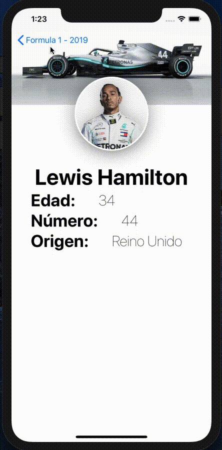

<h1 align="center">
  <br>
  <a href="http://www.ivancoder.com"></a>
</h1>

# Corredores de Formula 1

Aplicación móvil para mostrar todos los corredores de la formula 1 más famosos.<br/>
<!-- www.udemy.com/course/swift-ui-ios13/ -->
Del curso [Diseño de apps para iOS 13 con Swift UI desde cero](https://www.udemy.com/course/swift-ui-ios13/) de la plataforma Udemy.

## Índice

- [Instalación](#instalación)
- [Uso](#uso)
- [Características](#características)
- [Vista Previa](#vista-previa)
- [Tecnologías Utilizadas](#tecnologías-utilizadas)
- [Redes Sociales o formas de contacto](#redes-sociales-o-formas-de-contacto)

## Instalación

```bash
# Clonar el repositorio
git clone https://github.com/ivxn31/CursoSwiftUI-29-08-2019.git

# Navegar al directorio del proyecto
cd CursoSwiftUI-29-08-2019
```

## Uso
Compilar el proyecto en Xcode compatible para SwiftUI.

## Características
- La vista principal (DriversScreen) está envuelta en un NavigationView, lo que permite la navegación entre diferentes pantallas.
- Dentro del NavigationView, hay una lista (List) que itera sobre una colección de conductores (drivers), mostrando un elemento por cada conductor.
- Cada elemento de la lista es un NavigationLink, lo que permite que al seleccionar un conductor, la aplicación navegue a otra pantalla (DriverScreen) que muestra más detalles sobre ese conductor.
- Dentro del NavigationLink, se utiliza un DriverAdapter una vista personalizada para representar la información del conductor en la lista.
- La pantalla pone un fuerte énfasis en las imágenes, especialmente con la presentación destacada de la imagen del conductor en un círculo con bordes y sombras, creando un enfoque visual.
- El nombre del conductor se muestra de manera prominente con un tamaño de fuente grande y negrita, lo que atrae la atención hacia la identidad del conductor.
- La pantalla (DriverScreen) facilita la lectura y comprensión de la información.


## Vista Previa
<!-- Codigo de ejemplo para darle tamaño a las imagenes y mostrar mas imagenes  -->
<!-- alternativa 01  -->
<!-- alternativa 02 {width=100 height=100} -->
<!--  -->


## Tecnologías Utilizadas
- Lenguaje Swift
- SwiftUI
- Xcode

## Redes Sociales o formas de contacto
<p align="center">
  <a href="https://www.linkedin.com/in/ivan-tecp-martinez/" target="_blank">
    
  </a>
  <a href="https://www.ivancoder.com/" target="_blank">
    
  </a>
</p>

